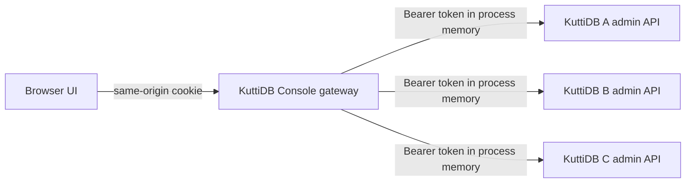

# KuttiDB Management UI implementation plan

Status: implementation-ready handoff
Target: KuttiDB Management API contract `1.0` at `/api/admin/v1`
Package manager: pnpm
Primary deliverable: a self-hosted, desktop-first responsive web console that manages multiple KuttiDB instances

## 1. Product outcome

Build a calm, fast operations console that lets an operator:

- save non-secret connection profiles for several KuttiDB instances;
- connect to one or more profiles by pasting each instance's admin token;
- switch instances without leaving the authenticated application shell;
- add, edit, disconnect, reconnect, and remove connections from both the entry screen and the authenticated UI;
- discover the exact capabilities of every connected instance before showing controls;
- inspect and operate Keyspaces, Queues, Streams, Consumer Groups, Routing, atomic operations, maintenance, and jobs exclusively through the Management API;
- understand dangerous or uncertain operations before taking action;
- run the console locally with Docker Compose and in Kubernetes.

The product should feel enterprise-ready without looking sterile. KuttiDB's warm, smiling toast mark supplies personality; dense operational screens remain restrained, legible, and predictable.

## 2. Repository facts and constraints

The implementation agents must treat the repository as the source of truth, especially:

- `openapi/management-v1.yaml` for the HTTP contract;
- `MANAGEMENT_API.md` for operator-facing behavior;
- `FULL_MANAGEMENT_API_INSTRUCTION.md` for security, mutation, cursor, and binary-data rules;
- `src/admin_http.c` and `src/test_management_api.py` for implemented behavior and contract tests;
- `compose.yaml`, `Dockerfile`, and `deploy/kubernetes/` for current deployment conventions.

Important constraints already present in KuttiDB:

1. The admin listener is optional and disabled unless `--admin-bind` is set.
2. Every Management API request, including `OPTIONS` and SSE, requires `Authorization: Bearer <admin-token>`.
3. The v1 token has full administrative power. KuttiDB does not provide users, passwords, OAuth, sessions, or RBAC.
4. The UI must never persist tokens in local storage, IndexedDB, URLs, exports, logs, analytics, or crash reports.
5. Non-loopback Management API traffic requires native TLS.
6. Controls must be gated by `/capabilities`, not inferred from a server version.
7. Binary identifiers are opaque `b64u:` values and must be preserved exactly in API paths.
8. Mutations may require `Idempotency-Key`, `If-Match`, and `X-KuttiDB-Confirm`.
9. `operation_in_doubt` must never be retried automatically.
10. Collections are bounded, cursor-based, and can be weakly consistent.
11. The current repository has no JavaScript workspace. The UI must be added without disturbing the C build.
12. KuttiDB is a single-node durable store, not a replicated cluster. The UI must never imply otherwise.

## 3. Architecture decision

### 3.1 Use a same-origin UI gateway

Do not call KuttiDB directly from browser code. A browser cannot attach a bearer token to an automatic CORS preflight, while KuttiDB authenticates `OPTIONS`. Direct cross-origin browser access is therefore not a reliable architecture.

Use one Node.js service that:

- serves the built React application;
- owns short-lived, in-memory connection sessions;
- adds the correct bearer token to requests sent to a selected KuttiDB instance;
- forwards only the supported `/api/admin/v1` methods and paths;
- streams authenticated SSE responses without buffering them;
- strips secrets and payloads from logs;
- exposes its own liveness and readiness endpoints.

Browser and gateway remain same-origin. The browser receives only an opaque, HttpOnly session cookie; it never receives a token after connection setup.



### 3.2 Session and profile model

Use two deliberately separate models:

`ConnectionProfile` is safe to persist in browser storage:

```ts
type ConnectionProfile = {
  id: string;                 // random UUID; safe in routes
  label: string;
  endpoint: string;           // origin only, no credentials/query/fragment
  color: ConnectionColor;
  rememberProfile: boolean;
  lastConnectedAt?: string;
};
```

`LiveConnection` exists only in bounded gateway memory:

```ts
type LiveConnection = {
  profileId: string;
  endpoint: URL;
  token: Buffer;
  capabilities: Capabilities;
  connectedAt: number;
  lastUsedAt: number;
};
```

Rules:

- Store remembered profiles under one versioned browser-storage key. Never include a token.
- Use a cryptographically random, opaque session ID in a `HttpOnly`, `SameSite=Strict` cookie. Set `Secure` outside local HTTP development and omit `Max-Age` so it is a browser-session cookie.
- Bound the global session count, connections per session, token length, and idle lifetime.
- On disconnect, expiry, eviction, or shutdown, overwrite token buffers before dropping references. Accept that transient JavaScript strings created while parsing headers cannot be perfectly zeroized; compensate with no logging, no telemetry, no heap dumps, and short retention.
- Refreshing the browser should preserve live connections while the gateway process and session cookie remain alive.
- A gateway restart intentionally locks all profiles and requires token re-entry.
- Do not add Redis or another credential store in v1. Ship one gateway replica. Document sticky sessions plus an audited ephemeral secret-store design as prerequisites for horizontal scaling.
- Database admin tokens authenticate KuttiDB connections; they are not user identity. Enterprise deployments should put the console behind an existing OIDC/SSO ingress. Do not invent UI roles that KuttiDB cannot enforce.

### 3.3 Gateway request boundary

Expose a small console-owned API:

| Method and path | Purpose |
| --- | --- |
| `GET /ui-api/session` | Return session state and live profile IDs, never tokens |
| `POST /ui-api/connections` | Validate endpoint/token via `/capabilities`, then create or replace a live connection |
| `GET /ui-api/connections/:profileId` | Return safe connection and capability metadata |
| `DELETE /ui-api/connections/:profileId` | Disconnect and clear the in-memory token |
| `ANY /ui-api/connections/:profileId/admin/*` | Allowlisted proxy to `/api/admin/v1/*` |
| `GET /health/live` | Process liveness only |
| `GET /health/ready` | Static assets and session store initialized; does not depend on every database |

Proxy rules:

- Accept only `GET`, `HEAD`, `POST`, `PUT`, `PATCH`, and `DELETE` for admin forwarding.
- Normalize `/admin/*` to `/api/admin/v1/*`; never accept an arbitrary upstream URL in a proxy path or request body.
- Inject `Authorization`; never forward a browser-supplied authorization header.
- Forward only `Accept`, `Content-Type`, `Idempotency-Key`, `If-Match`, `X-KuttiDB-Confirm`, and `X-KuttiDB-Request-ID`.
- Return only safe response headers: content type, ETag, Retry-After, Cache-Control, and `X-KuttiDB-Request-ID`.
- Keep normal KuttiDB response bodies bounded and stream SSE incrementally.
- Abort the upstream request when the browser disconnects.
- Apply connect, request, payload-byte, and concurrent-SSE limits per UI session.
- Set explicit upstream connect, headers, body, and idle timeouts. SSE uses a separate bounded idle policy.
- Never auto-follow redirects from a KuttiDB endpoint.
- Never cache admin responses in a CDN, service worker, browser cache, or gateway cache.

### 3.4 SSRF and network policy

The gateway can reach operator-supplied endpoints, so connection validation is a security boundary:

- Require an origin only: `https://host[:port]`, with `http://127.0.0.1`, `http://localhost`, or `http://[::1]` allowed only in explicit development mode.
- Reject usernames, passwords, paths other than `/`, query strings, fragments, unsupported schemes, and Unicode hostname ambiguity.
- Resolve DNS before connecting and validate every returned address against the configured policy.
- Revalidate the connected socket address to mitigate DNS rebinding.
- Block link-local, multicast, unspecified, and cloud metadata ranges unconditionally.
- Default production policy to a required hostname/CIDR allowlist. Private RFC1918 targets are allowed only when the operator enables them or includes them in the allowlist.
- Configure egress NetworkPolicy in Kubernetes to the known KuttiDB namespaces/CIDRs.
- Preserve TLS certificate verification. Do not ship an “ignore certificate errors” switch. Support a mounted custom CA bundle instead.

## 4. Proposed monorepo layout

```text
/
├── apps/
│   └── management-ui/
│       ├── package.json
│       ├── vite.config.ts
│       ├── tsconfig.json
│       ├── index.html
│       ├── public/
│       │   └── brand/
│       └── src/
│           ├── client/
│           │   ├── app/
│           │   ├── components/
│           │   ├── features/
│           │   ├── routes/
│           │   ├── styles/
│           │   └── main.tsx
│           └── server/
│               ├── app.ts
│               ├── config.ts
│               ├── connection-store.ts
│               ├── target-policy.ts
│               ├── proxy.ts
│               ├── redaction.ts
│               └── index.ts
├── packages/
│   ├── admin-client/
│   │   ├── generated/
│   │   ├── src/
│   │   └── package.json
│   ├── ui/
│   │   ├── src/
│   │   └── package.json
│   └── tooling/
│       ├── eslint/
│       └── typescript/
├── deploy/
│   ├── docker/
│   │   └── management-ui.Dockerfile
│   └── kubernetes/
│       └── management-ui/
│           ├── kustomization.yaml
│           ├── deployment.yaml
│           ├── service.yaml
│           ├── configmap.yaml
│           ├── network-policy.yaml
│           └── sidecar-example.patch.yaml
├── compose.management.yaml
├── package.json
├── pnpm-workspace.yaml
└── pnpm-lock.yaml
```

Keep the existing C source, Makefile, and CMake build valid for users without Node installed. Add separate root commands such as `ui:dev`, `ui:build`, `ui:test`, and `ui:e2e`; do not make the default `make` path download JavaScript dependencies.

## 5. Technical stack

Use supported, pinned versions captured in `pnpm-lock.yaml` and pin pnpm in the root `packageManager` field.

- React + TypeScript + Vite for the client.
- Fastify on Node.js for the same-origin gateway and static serving.
- TanStack Router for typed routes.
- TanStack Query for server state, polling, cancellation, and cache invalidation.
- React Hook Form + Zod for forms and boundary validation.
- Radix UI primitives for accessible dialogs, menus, popovers, tabs, and tooltips.
- Lucide for interface icons. Do not use emoji as product icons.
- Recharts only for overview time-series or distribution charts that materially improve comprehension.
- `openapi-typescript` to generate types from `openapi/management-v1.yaml`.
- A small handwritten client layer for ETags, request IDs, idempotency, cursor pages, and SSE; generated types must not dictate UX architecture.
- Vitest + Testing Library + MSW for unit/component/contract tests.
- Playwright for critical browser flows.
- axe-core for automated accessibility checks.

Use the currently supported Node.js LTS line in development, CI, and the container image. Do not use runtime CDN assets; self-host fonts and the KuttiDB mark.

## 6. Visual system: “Warm Operations”

### 6.1 Brand translation

The supplied logo has a cream field, toasted amber body, cocoa outline, sesame flecks, and a friendly expression. Translate that into the application as follows:

- Cream is the quiet page canvas, not the color of every panel.
- Toasted amber is the main action/accent color, used sparingly.
- Cocoa is the primary text and navigation tone.
- Sesame-like warm grays support borders and secondary text.
- The bite shape appears only as a subtle brand detail in onboarding/empty states, never as a repeated gimmick around every card.
- The face appears on the connection hub and empty states; dense data tables use the compact mark without the face competing for attention.

Before implementation, obtain/export a production logo asset with a transparent background in SVG or high-resolution PNG. Do not trace or redraw the attached bitmap in CSS or an improvised SVG. Create a square app icon, favicon, full lockup, and a dark-background-safe treatment from the approved source asset.

### 6.2 Initial design tokens

These are starting values; verify WCAG contrast in implementation and adjust tones without losing the brand relationship.

| Token | Suggested value | Use |
| --- | --- | --- |
| `canvas` | `#F7F3E8` | light page background |
| `surface` | `#FFFCF6` | cards, drawers, dialogs |
| `surface-strong` | `#F0E8D8` | selected/raised neutral |
| `text` | `#38251D` | primary text |
| `text-muted` | `#74645B` | secondary text |
| `border` | `#DED3C2` | structural borders |
| `brand` | `#D97A24` | primary actions, focus accents |
| `brand-hover` | `#B85F18` | hovered primary action |
| `brand-soft` | `#FBE4BC` | badges, selected nav |
| `success` | `#267A57` | healthy state |
| `warning` | `#9A6712` | degraded/attention |
| `danger` | `#B33A35` | destructive action |
| `info` | `#356F92` | neutral operational info |

Typography:

- locally bundled Inter Variable for UI copy;
- locally bundled JetBrains Mono Variable for IDs, offsets, request IDs, payloads, and numbers;
- 14 px default body, 12–13 px table/meta text, 20–30 px page headings;
- tabular numerals for metrics and offsets.

Geometry and motion:

- 8 px spacing grid with 4 px fine adjustments;
- 10 px controls and cards, 14 px dialogs/large surfaces;
- 1 px structural borders and restrained shadows;
- 160–200 ms state transitions; honor `prefers-reduced-motion`;
- visible 2 px focus ring with an additional offset from the component edge.

### 6.3 Shell

Desktop:

- 240 px left navigation with KuttiDB mark, current connection switcher, primary resources, and connection status.
- 64 px top bar with breadcrumb, current server health, refresh state, command/search affordance, theme, and connection actions.
- Content area uses a maximum readable width for forms and full-width tables where needed.

Compact/tablet:

- collapsible navigation rail;
- connection switcher remains visible in the top bar;
- tables prioritize essential columns and move secondary metadata into row detail.

Mobile is supported for status checks and simple reads, but destructive workflows and dense record operations may show an explicit “use a wider screen” treatment rather than a cramped unsafe experience.

## 7. Information architecture and routes

```text
/connections
/connections/new
/c/:profileId/overview
/c/:profileId/keyspace
/c/:profileId/keyspace/:entryId
/c/:profileId/queues
/c/:profileId/queues/:queueId
/c/:profileId/queue-consumers
/c/:profileId/streams
/c/:profileId/streams/:streamId
/c/:profileId/streams/:streamId/groups/:groupId
/c/:profileId/routing
/c/:profileId/routing/:routerId
/c/:profileId/operations/atomic
/c/:profileId/operations/maintenance
/c/:profileId/operations/jobs
/settings/connections
```

Navigation must be capability-aware. Hide an unavailable resource family when it is truly absent; show disabled actions with a plain explanation when the resource exists but the operation is unavailable or unhealthy.

## 8. Core user flows

### 8.1 First connection

1. `/connections` shows the logo, a concise security explanation, and saved profiles if any.
2. “Add KuttiDB” opens a focused form with label, admin endpoint, admin token, and optional profile color.
3. The token field is password-masked by default, has a temporary reveal action, disables browser autofill/password-manager capture where practical, and is never echoed back.
4. Submit sends the profile ID, endpoint, and token to `POST /ui-api/connections` over same-origin HTTPS.
5. Gateway calls `/capabilities`, requires product `KuttiDB` and supported `management_api_contract`, and stores the token only after validation.
6. Success enters `/c/:profileId/overview`; failure stays in context with actionable error copy and the KuttiDB request ID when available.

### 8.2 Add a connection from inside the app

1. Current connection switcher includes “Manage connections” and “Add connection”.
2. Add opens the same reusable form in a dialog on desktop and a full-page flow on compact screens.
3. Connecting does not replace or disconnect existing live connections.
4. Success switches to the new connection and preserves current per-profile route state so switching back restores context.

### 8.3 Switch, lock, and remove

- Switcher groups profiles into Connected, Needs token, Degraded, and Unreachable.
- “Disconnect” clears the live token but retains the profile.
- “Reconnect” asks only for the token unless the endpoint is edited.
- “Remove profile” disconnects first, clears browser profile metadata, and confirms because it removes local configuration—not database data.
- “Lock all” clears every in-memory token for the current UI session.

### 8.4 Capability bootstrap

For every connection:

1. fetch `/capabilities` before any other resource call;
2. validate the contract shape at runtime;
3. cache it for the live connection, with a manual refresh and a conservative periodic refresh;
4. derive navigation/actions from `enabled_engines`, `operations`, `limits`, `sse`, `audit`, and persistence fields;
5. never infer support from `server_version`;
6. lock all mutations when audit health is false and explain why reads remain available.

### 8.5 Safe mutation

Create one shared mutation coordinator used by every feature:

- Generate a UUID idempotency key at the moment of one user intent.
- Keep that key while retrying only a request known not to have been dispatched.
- Never silently retry a non-idempotent operation after an ambiguous network failure.
- Capture ETag from the most recent detail request.
- Immediately before destructive confirmation, refresh the resource, show current affected counts, and update the ETag.
- Require the operator to type or paste the exact canonical target ID when the API requires confirmation.
- Send `If-Match` and `X-KuttiDB-Confirm` exactly.
- On `412`, close neither context nor form; explain that state changed and offer a refresh.
- On `428`, flag a client-contract defect in development and show a safe refresh message in production.
- On `operation_in_doubt`, show a persistent critical banner with the request ID, disable repeat, and require target refresh/reconciliation before another attempt.

### 8.6 Disconnect and session expiry

When a live session is missing or expires:

- preserve the current profile and route;
- replace protected content with a reconnect sheet;
- never redirect all the way to a blank generic login page;
- after reconnect, restore the intended route and refetch from the server.

## 9. Screen and API coverage

### 9.1 Connection hub

Show remembered profiles as compact cards with label, endpoint, last connection time, and safe state. Connected cards include server version, contract, readiness, and engine health. Primary actions are Connect/Open, Add KuttiDB, Edit profile, Disconnect, and Remove profile.

Do not show a combined “all databases” mutation surface. Cross-instance overview is read-only to prevent acting on the wrong target.

### 9.2 Overview

Use `/status`, `/capabilities`, `/maintenance`, and active jobs.

Sections:

- top health strip: Ready/Degraded, server version, uptime, durability, audit health;
- engine cards: Keyspace entries/bytes, Queue count/depth/in-flight, Stream count/partitions/retained bytes, Consumer Group members;
- management pressure: active tails/deliveries/claims, queued/running jobs, rejections;
- persistence health with clear per-engine states;
- small recent-session activity summary based only on operations performed through this browser session. Do not claim this is the server audit log.

Poll visible overview data around every 15 seconds with jitter; back off on failure and pause when the tab is hidden. Always offer explicit refresh and show last-updated time.

### 9.3 Keyspace

API families: `/keyspaces`, `/keyspaces/default`, entries, batch operations, claims, and get-or-refresh.

UI:

- metadata table with cursor pagination, prefix filter, TTL-present filter, and weak-consistency notice;
- entry drawer with canonical ID, decoded-name preview when valid, expiry, size, and value viewer;
- create/update form supporting Text, JSON, and Base64 input modes, with exact byte count and optional TTL;
- batch get/put/delete import editor capped from capabilities;
- advanced claims/get-or-refresh panel, clearly explaining lease expiry.

Never substitute a decoded name for the opaque entry ID in API paths.

### 9.4 Queues and durable consumers

API families: `/queues`, queue messages, deliveries, queue consumers, publish, purge, and delete.

List:

- queue name/ID, ready, delayed when available, in-flight, redelivery/dead-letter counters, and persistence state;
- create queue action shown only when advertised.

Detail tabs:

- Overview: depth, revision/ETag, route dependencies, limits.
- Messages: non-mutating browse with state filter, body opt-in, cursor pagination, and explicit “Browsing does not consume” copy.
- Publish: single and bounded batch, Text/JSON/Base64 composer.
- Deliveries: advanced consume workspace with a lease countdown; ACK/NACK/requeue/discard actions; expired receipts become immutable.
- Consumers: register, inspect, consume, and unregister durable consumers.

Purge/delete use the shared destructive flow and show retained/in-flight counts plus route blockers.

### 9.5 Streams

API families: streams, partitions, records, append, fetch, tail, retention, truncate, and delete.

List and detail:

- stream identity, partition count, retained record/byte counts, retention ceilings, revision;
- partition table with earliest and next offsets;
- record browser with partition, offset, bounded page size, decoded key/body previews, and exact canonical data;
- append composer for single/batch records;
- live tail panel using SSE, explicit start/stop, connection state, record-rate indicator, retention-gap message, and bounded in-memory rows;
- retention editor with before/after values and ETag;
- truncate/delete through destructive confirmation and job handoff where the API returns `202`.

The tail view must stop on route change, connection switch, browser disconnect, or session lock. Do not let background tails consume the server limit invisibly.

### 9.6 Consumer Groups

API families: group list/detail, members, offsets, offset commit/batch/reset, and Management sessions.

UI:

- overview table with stream, group, generation, active members, total lag;
- detail with partition offset/high-water/lag table and privacy-safe member information;
- commit controls that use the current generation;
- reset wizard for earliest/latest/absolute/relative, with active-member warning, force semantics, exact target confirmation, and clear partition preview;
- advanced Management session workspace for join, assignment, heartbeat, fetch, commit, and leave.

Management sessions need a visible lease timer and best-effort leave on navigation, but correctness must rely on server expiry rather than browser cleanup.

### 9.7 Routing

API families: routers, routes, alternate-router update, publish, and default routing publish.

UI:

- router table and detail page;
- topology list grouped by exact, broadcast, and pattern mode;
- route create/delete with queue dependencies and current router ETag;
- alternate router selector that prevents obvious client-side cycles but treats server validation as authoritative;
- publish composer that shows routed count and unroutable outcome without implying delivery.

Start with an accessible structured topology list. Add a visual graph only after it has a real operational benefit and remains usable with keyboard and screen readers.

### 9.8 Atomic operations

Provide a schema-driven advanced form for the supported tagged operations from `/capabilities`. Show the Keyspace action and Queue/Routing delivery action as one composed transaction preview. Require a single idempotency key and display the returned transaction ID. Do not provide arbitrary JSON by default; an “expert JSON” editor may exist behind an explicit toggle.

### 9.9 Maintenance and jobs

Maintenance:

- show checkpoint availability and persistence state per engine;
- allow individual or all-engine checkpoints only when advertised;
- explain that jobs are asynchronous and bounded.

Jobs:

- list queued/running/completed/failed/cancelled jobs;
- poll only visible non-terminal jobs with backoff;
- allow cancellation only while the job is queued;
- preserve job and request IDs for support/debugging;
- link a job back to the resource operation that created it when safe metadata permits.

## 10. Shared client behavior

### 10.1 Runtime validation

OpenAPI-generated TypeScript types are compile-time only. Add focused Zod schemas for boundaries that drive safety:

- capabilities;
- stable error envelope;
- collection metadata;
- ETag-bearing mutable resources;
- job state;
- SSE event envelopes.

Unknown additive fields must be preserved or ignored safely. Unknown capability operations must not activate controls.

### 10.2 Errors

Map stable error codes to consistent presentation:

| Error | UI behavior |
| --- | --- |
| `unauthorized` | lock that profile and ask for its token again |
| `forbidden_origin` | gateway/configuration diagnostic; no blind retry |
| `validation_failed` | field-level errors when details are safe |
| `rate_limited` | honor Retry-After and disable only the affected action |
| `resource_exhausted` | explain the relevant server limit from capabilities |
| `precondition_failed` | refresh resource and require a new confirmation |
| `persistence_unavailable` | block dependent mutations, keep safe reads |
| `audit_unavailable` | globally block mutations for that connection |
| `delivery_expired` | mark receipt expired and remove action buttons |
| `operation_in_doubt` | persistent critical reconciliation state; never auto-retry |

Every error surface should offer a copy button for the safe request ID. Never show a token or raw low-level network stack trace.

### 10.3 Binary data

Create one reusable `BinaryValue` component and codec module:

- canonical Base64 is always available;
- UTF-8 and JSON previews are opt-in interpretations, never replacements;
- invalid UTF-8 remains Base64/hex;
- show decoded byte size before mutation;
- copy/export defaults to canonical content;
- large bodies are loaded only after explicit request and within reported limits;
- never insert arbitrary payload HTML into the DOM.

### 10.4 Cursor pagination

- Treat cursors as opaque and profile/resource/filter-specific.
- Use Next-page navigation; do not fabricate numbered pages.
- Keep a local back stack of earlier cursors for the current view.
- Reset cursor history when filters, connection, or snapshot identity changes.
- Display a quiet “May change while you browse” message when `weakly_consistent` is true.
- On cursor expiry/invalidity, reset to the first page and explain what happened.

## 11. Accessibility and quality bar

- WCAG 2.2 AA contrast for text, icons, focus, charts, and state badges.
- All workflows operable by keyboard; no hover-only actions.
- Dialog focus trap, return focus, Escape behavior, and destructive-button labeling verified.
- Tables have captions or accessible names, real headers, and readable empty/loading/error states.
- Health is never represented by color alone; include icon and text.
- Live tail updates use a user-controlled pause and do not continuously announce every record to screen readers.
- Respect reduced motion and browser zoom to 200%.
- Minimum 44 px touch targets on compact layouts.
- Dates use the user's locale and show a precise ISO value on demand.
- Metrics use tabular numerals and unit formatting without destroying exact-value access.

## 12. Docker implementation

### 12.1 Console image

Create a multi-stage image:

1. Node LTS + Corepack build stage.
2. Copy workspace manifests first for deterministic dependency caching.
3. `pnpm install --frozen-lockfile`.
4. Generate the admin client, then lint, typecheck, test, and build.
5. Copy only the compiled server, static client, production dependencies, licenses, and package metadata to the runtime stage.
6. Run as a dedicated non-root UID/GID, with read-only root filesystem compatibility.
7. Listen on `0.0.0.0:8080`; expose `/health/live` and `/health/ready`.

Use a small init only if signal forwarding is not already correct. Handle SIGTERM by stopping new requests, closing SSE streams, zeroing token buffers, and exiting within the platform grace period.

### 12.2 Compose

Do not overload the existing minimal `compose.yaml`. Add `compose.management.yaml` as an opt-in overlay.

The default local reference should avoid weakening KuttiDB's TLS rule:

- add the admin token secret and audit volume to the KuttiDB service;
- bind KuttiDB admin to `127.0.0.1:7380`;
- run the console in the KuttiDB service's network namespace for the bundled single-instance demo;
- publish console port `127.0.0.1:8080:8080` from that shared namespace;
- configure the console target allowlist for `127.0.0.1:7380`;
- require the operator to paste the same admin token into the UI; do not mount it into the console;
- retain support for additional remote KuttiDB connections over verified HTTPS.

Document the exact command:

```sh
KUTTIDB_AUTH_TOKEN_FILE=./token \
KUTTIDB_ADMIN_TOKEN_FILE=./admin.token \
docker compose -f compose.yaml -f compose.management.yaml up --build
```

Also provide a TLS-enabled multi-container example for teams that do not want a shared network namespace. It must use a site-specific KuttiDB image built with OpenSSL, native admin TLS, mounted certificate/key/CA files, and no certificate-verification bypass.

## 13. Kubernetes implementation

Ship a Kustomize-ready base under `deploy/kubernetes/management-ui/`:

- `Deployment` with exactly one replica;
- `ClusterIP` Service on 8080;
- ConfigMap for non-secret target policy and UI settings;
- liveness/readiness probes;
- non-root, read-only root filesystem, dropped capabilities, seccomp runtime default;
- CPU/memory requests and limits;
- topology/availability settings that do not imply the gateway can scale horizontally;
- restrictive ingress documentation and NetworkPolicy;
- optional mounted custom CA bundle;
- PodDisruptionBudget only if it does not promise uninterrupted in-memory sessions.

Provide two connection patterns:

1. Recommended shared console: standalone Deployment, exposed behind the platform's HTTPS + OIDC/SSO ingress, connecting only to allowlisted KuttiDB HTTPS admin endpoints.
2. Single-instance example: console sidecar in the KuttiDB StatefulSet, with the admin listener on loopback and a Service exposing only the console. This is the easiest reference manifest and still lets the console reach additional HTTPS instances.

Do not put KuttiDB admin tokens in console environment variables, ConfigMaps, browser bootstrap JSON, or Deployment arguments. Operators paste them at runtime. Kubernetes Secrets remain appropriate for KuttiDB's own token file, but the console must not read those Secrets automatically in v1.

## 14. Configuration contract

Document and validate these gateway settings at startup:

| Variable | Purpose | Safe default |
| --- | --- | --- |
| `HOST` | listen address | `0.0.0.0` |
| `PORT` | console port | `8080` |
| `PUBLIC_ORIGIN` | exact browser origin for origin checks | required outside local dev |
| `TRUST_PROXY` | trusted proxy hops/CIDRs | off |
| `SESSION_IDLE_MINUTES` | live credential idle expiry | 30 |
| `SESSION_MAX_MINUTES` | absolute live session expiry | 480 |
| `MAX_SESSIONS` | global bounded sessions | conservative fixed default |
| `MAX_CONNECTIONS_PER_SESSION` | live KuttiDB connections | 10 |
| `MAX_SSE_PER_SESSION` | live tails | 2 |
| `TARGET_ALLOWLIST` | hostname/CIDR patterns | required in production |
| `ALLOW_PRIVATE_TARGETS` | permit RFC1918 targets | false unless explicitly set |
| `ALLOW_LOOPBACK_HTTP` | local/sidecar development | false outside reference deployment |
| `CUSTOM_CA_FILE` | additional trusted CA bundle | unset |
| `LOG_LEVEL` | structured safe logs | `info` |

Fail startup on invalid or contradictory production configuration. Provide a `/ui-api/config` response containing only safe public UI settings when needed.

## 15. Testing strategy

### 15.1 Generated contract gate

- `pnpm generate:admin-client` reads the checked-in OpenAPI file.
- `pnpm check:generated` fails when generated files are stale.
- Add fixtures captured from representative `src/test_management_api.py` responses, stripped of dynamic IDs.
- Contract tests must fail when the UI assumes a field or operation absent from the schema/capabilities.
- Keep additive unknown fields accepted.

### 15.2 Gateway tests

Cover:

- valid connect, wrong token, unsupported product/contract, unreachable target, TLS failure;
- no token in response bodies, headers, structured logs, thrown errors, or snapshots;
- session creation, isolation, idle/absolute expiry, eviction, lock all, and shutdown cleanup;
- strict origin/CSRF checks for console-owned mutations;
- method/path/header allowlists and hop-by-hop stripping;
- SSRF cases: credentials in URL, redirects, metadata IPs, link-local, DNS rebinding, mixed DNS results, and private-network policy;
- exact ETag, confirmation, request ID, Retry-After, and idempotency forwarding;
- body limits and aborted client connections;
- SSE streaming, disconnect, idle timeout, and per-session limits;
- no automatic retry after ambiguous mutation dispatch.

### 15.3 Client unit/component tests

Cover:

- capability-gated navigation/actions;
- token fields never persisted;
- profile persistence contains only allowlisted keys;
- cursor back stack and expiry reset;
- binary codecs and invalid UTF-8;
- mutation coordinator behavior for 412, 428, 429, audit failure, delivery expiry, and operation in doubt;
- accessibility of switcher, dialogs, data tables, tabs, and notifications;
- connection switch cancels old queries and SSE streams;
- stale data is visibly labeled and not reused across profile IDs.

### 15.4 End-to-end tests

Run against a real ephemeral KuttiDB process/container, not only mocks:

1. first connection and capability bootstrap;
2. add a second connection, switch between them, and prove cache isolation;
3. refresh and reconnect behavior;
4. Keyspace put/read/delete with binary and UTF-8 values;
5. Queue create/publish/browse/consume/ACK/NACK/purge/delete;
6. Stream create/append/fetch/tail/retention/truncate/delete;
7. Consumer Group inspect/reset safety;
8. Routing create/bind/publish/delete;
9. maintenance job start/poll/cancel rules;
10. stale ETag and exact confirmation handling;
11. forced `operation_in_doubt` fixture with no automatic retry;
12. session expiry and token re-entry;
13. Docker health and SIGTERM behavior.

Keep destructive E2E data isolated with unique test IDs and temporary WAL/audit files.

### 15.5 Visual and responsive QA

Capture deterministic Playwright screenshots for:

- empty connection hub;
- multiple mixed-state connections;
- overview healthy and degraded;
- dense Keyspace/Queue/Stream tables;
- destructive confirmation;
- operation-in-doubt state;
- 1440 px, 1024 px, and compact viewport layouts;
- light and dark themes if dark mode ships in the first release.

Review screenshots for hierarchy, clipping, table overflow, focus, contrast, and the restrained use of brand motifs. Do not treat snapshots as the only accessibility or behavior test.

## 16. CI and developer commands

Root scripts should provide:

```sh
pnpm install --frozen-lockfile
pnpm generate:admin-client
pnpm check:generated
pnpm lint
pnpm typecheck
pnpm test
pnpm build
pnpm test:e2e
pnpm test:a11y
```

Add a dedicated UI CI job that:

1. installs with the pinned pnpm version through Corepack;
2. checks generated API code;
3. runs lint, typecheck, unit, and accessibility tests;
4. builds the production image;
5. starts the Compose management stack;
6. runs real KuttiDB E2E tests;
7. scans the built image and produces an SBOM;
8. verifies the image runs as non-root with a read-only root filesystem.

Keep existing C CI independent, then add one integration gate that builds KuttiDB and the management console together.

## 17. Agent execution plan

Use small reviewable changes. Agents must not edit the same shared foundation files in parallel unless one owner coordinates the merge.

### Wave 0 — contract and decisions (Agent A, blocking)

Deliverables:

- add the pnpm workspace and root scripts;
- scaffold `apps/management-ui`, `packages/admin-client`, and `packages/ui` without feature screens;
- implement OpenAPI type generation and stale-generation check;
- add architecture decision records for the same-origin gateway, in-memory tokens, one-replica limit, and target policy;
- add response fixtures and a minimal real-API smoke test;
- settle the production logo asset input with the product owner.

Acceptance:

- existing `make`/CMake flows still work without Node;
- `pnpm install`, generate, typecheck, test, and build pass;
- no generated or scaffold code contains a token persistence path.

### Wave 1A — gateway and security (Agent A)

Owned files: `apps/management-ui/src/server/**`, server tests, gateway configuration docs.

Deliverables:

- bounded session/connection store;
- connect/disconnect/session endpoints;
- target validation and SSRF policy;
- strict origin checks and secure cookie handling;
- allowlisted normal proxy and SSE proxy;
- redacted structured logging and graceful shutdown;
- liveness/readiness.

Acceptance: all gateway tests in section 15.2 pass, including secret-leak assertions.

### Wave 1B — design system, shell, and connection UX (Agent B)

Owned files: `packages/ui/**`, client app shell, connection feature, styles, Storybook or component preview if chosen.

Deliverables:

- final tokens, typography, icon rules, light theme, and dark theme only if fully verified;
- connection hub, add/edit/reconnect flows, switcher, lock all;
- responsive shell, navigation, breadcrumbs, loading/empty/error states;
- common table, form, dialog, badge, code/value viewer, and destructive dialog primitives;
- accessibility and visual baselines.

Acceptance: a user can manage several profiles and switch authenticated contexts using mock/live gateway data; no credential reaches browser persistence.

### Wave 1C — shared admin client and mutation safety (Agent C)

Owned files: `packages/admin-client/**`, client query/mutation infrastructure, MSW handlers.

Deliverables:

- typed client wrappers and runtime schemas;
- capability feature map;
- query keys namespaced by profile ID;
- cursor pagination helper;
- binary codecs;
- error normalization;
- ETag/idempotency/confirmation mutation coordinator;
- SSE client lifecycle.

Acceptance: shared behavior tests cover every stable error category and prove no cross-profile cache leakage or unsafe retry.

Wave 1 branches merge before resource feature work begins.

### Wave 2A — overview, Keyspace, and Queues (Agent B)

Owned files: `features/overview/**`, `features/keyspace/**`, `features/queues/**`, related routes/tests.

Deliverables and acceptance follow sections 9.2–9.4. Every advertised operation in those families is either implemented or explicitly placed in a documented post-v1 backlog; the release candidate should aim for full Management API coverage.

### Wave 2B — Streams and Consumer Groups (Agent C)

Owned files: `features/streams/**`, `features/consumer-groups/**`, related routes/tests.

Deliverables and acceptance follow sections 9.5–9.6, including bounded live tail, lease timers, group generations, and safe offset reset.

### Wave 2C — Routing, atomic operations, maintenance, and jobs (Agent D)

Owned files: `features/routing/**`, `features/operations/**`, related routes/tests.

Deliverables and acceptance follow sections 9.7–9.9. Do not create a fake audit-log page because v1 exposes health/counters, not audit entries.

### Wave 3A — Docker and Kubernetes (Agent D)

Owned files: `deploy/docker/management-ui.Dockerfile`, `compose.management.yaml`, `deploy/kubernetes/management-ui/**`, deployment docs.

Deliverables:

- reproducible non-root image;
- working Compose overlay using loopback/shared network namespace;
- TLS-enabled alternative documentation;
- Kustomize base, standalone and sidecar examples, probes, security context, and NetworkPolicy;
- manual smoke commands and CI hooks.

Acceptance: fresh Compose and Kubernetes smoke tests reach the connection hub, connect to a real instance, perform a read and safe test mutation, and shut down cleanly.

### Wave 3B — integration and release hardening (Agent A as integrator)

Deliverables:

- run the complete test matrix;
- fix capability mismatches discovered against the real server;
- verify all destructive and in-doubt paths;
- visual/accessibility review at target viewports;
- security review of token lifetime, logs, cookies, origin checks, target policy, and container/Kubernetes settings;
- update README, Management API UI-author notes, Docker, Kubernetes, and contributor docs;
- create a release checklist and known-limitations section.

No agent should “solve” a missing server capability by bypassing the Management API or using the native binary protocol.

## 18. Pull request sequence

Recommended review order:

1. `ui/01-workspace-openapi-foundation`
2. `ui/02-gateway-session-security`
3. `ui/03-design-system-connection-shell`
4. `ui/04-admin-client-mutation-safety`
5. `ui/05-overview-keyspace-queues`
6. `ui/06-streams-consumer-groups`
7. `ui/07-routing-atomic-maintenance-jobs`
8. `ui/08-compose-kubernetes`
9. `ui/09-e2e-accessibility-hardening-docs`

Each PR must include tests for its safety behavior and remain runnable. Avoid one final “integration” PR that introduces unreviewed feature logic.

## 19. Definition of done

The Management UI is complete when:

- a new user can add and connect to a KuttiDB from the entry screen;
- a connected user can add, edit, connect, switch, disconnect, remove, and lock connections inside the app;
- profiles survive refresh when opted in, but no admin token survives the in-memory session;
- every UI control is gated by live capabilities and health;
- all documented Management API resource families have usable UI workflows;
- binary IDs and bodies round-trip exactly;
- cursor, ETag, idempotency, confirmation, audit failure, rate limit, delivery expiry, and operation-in-doubt semantics are correctly represented;
- switching connections cannot leak cached data, SSE streams, jobs, request IDs, or mutations across profiles;
- the gateway passes the SSRF, CSRF/origin, secret redaction, bounded-resource, and graceful-shutdown tests;
- the console is keyboard-operable, meets WCAG 2.2 AA, and is verified at target viewports;
- `pnpm lint`, `pnpm typecheck`, unit tests, real-server E2E, and production build pass;
- Docker Compose starts a working local management stack;
- Kubernetes manifests deploy a secure one-replica console with documented standalone and sidecar connection patterns;
- the existing KuttiDB C build and tests remain green;
- documentation clearly states that KuttiDB v1 has one all-powerful admin token, no RBAC, no UI credential persistence, and no database replication.

## 20. Explicit non-goals for the first release

- Direct browser-to-KuttiDB API calls.
- Storing or auto-importing KuttiDB admin tokens.
- UI-managed user accounts, passwords, RBAC, OAuth, or OIDC.
- Horizontal gateway scaling without a separately approved ephemeral session design.
- Cross-instance mutations or bulk actions.
- Raw WAL, snapshot, filesystem, certificate, or audit-log browsing.
- Arbitrary scripts, SQL, or native binary protocol access.
- Presenting multiple standalone KuttiDB instances as a replicated cluster.
- Automatic retry of any ambiguous mutation.
- Telemetry or third-party analytics in the default build.

## 21. Product decisions to preserve during implementation

These decisions are intentional and should not be reopened casually:

1. The console gateway exists because of browser preflight behavior and token safety.
2. Remembered profile metadata and live credentials are different data classes.
3. The active database identity remains visible in every mutation and confirmation surface.
4. Dangerous operations optimize for certainty, not speed.
5. Capability discovery is authoritative; server versions are informational.
6. The logo provides warmth at the edges of the experience, while operational content stays disciplined.
7. A one-replica console is an honest consequence of in-memory credentials, not an accidental deployment omission.
8. Missing admin endpoints are resolved in the KuttiDB Management API, never by bypassing it.
